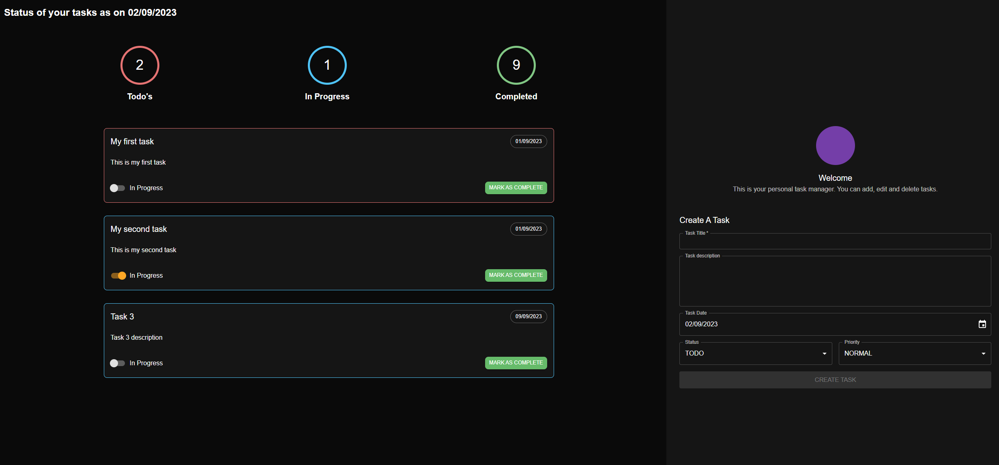

# A MERN Stack Task Management Application
## Description

This is a simple MERN stack application that uses the MySQL database to store and manage tasks.
Also uses React, Node.js, Express.js, and TypeORM for built in back end.
Front-end is built with React, Material-UI and Tanstack Query.

## Technologies Used

- React
- Node.js
- Express.js
- TypeScript
- Node-Ts
- TypeORM
- MySQL
- Material-UI
- Tanstack Query
- Context API

## Installation

1. Clone the repository
2. Install dependencies
3. Run `npm install`
4. Run `npm run dev`
5. Open `http://localhost:5173` in your browser for front end
6. Open `http://localhost:5174` in your browser or postman for back end

Also you should create .env file in the server folder and add the following variables:
- PORT=5174
- DB_USER=root
- DB_PASS=root
- DB_HOST=localhost
- DB_PORT=3306
- DB_NAME=task_management_app_db

Also you create a MySQL database with the name `task_management_app_db`

---

